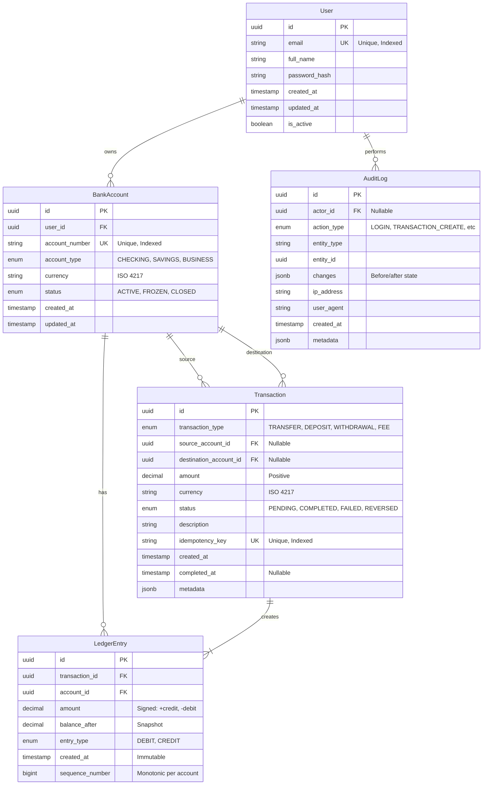

# Entity-Relationship Diagram

## Banking Application Data Model



## Visual Representation (Alternative)

```
┌─────────────┐
│    User     │
│  (Mutable)  │
└──────┬──────┘
       │ 1:N
       ↓
┌─────────────────┐
│  BankAccount    │
│   (Mutable)     │
│                 │
│ balance: DERIVED│ ← Calculated from LedgerEntry
└────┬────────┬───┘
     │        │
     │ 1:N    │ 1:N
     ↓        ↓
┌────────────────┐      ┌──────────────┐
│  Transaction   │ 1:N  │ LedgerEntry  │
│  (Immutable*)  │─────→│ (IMMUTABLE)  │
│                │      │              │
│ *once COMPLETED│      │ SOURCE OF    │
└────────────────┘      │   TRUTH      │
                        └──────────────┘
                               ↓
                        ┌──────────────┐
                        │  AuditLog    │
                        │ (IMMUTABLE)  │
                        │ Append-only  │
                        └──────────────┘
```

## Key Relationships

### 1. User → BankAccount (1:N)
- One user can own multiple bank accounts
- Cascade: Prevent deletion if accounts exist

### 2. BankAccount → LedgerEntry (1:N)
- One account has many ledger entries
- **LedgerEntry is the source of truth for balance**
- Cascade: Prevent deletion (ledger is immutable)

### 3. Transaction → LedgerEntry (1:N, minimum 2)
- Every transaction creates ≥ 2 ledger entries
- For transfers: exactly 2 entries (debit + credit)
- For deposits/withdrawals: ≥ 1 entry
- **Invariant: SUM(ledger_entries.amount) = 0 for each transaction**

### 4. BankAccount → Transaction (N:M via source/destination)
- Account can be source or destination of transactions
- Both fields are nullable (for external deposits/withdrawals)

### 5. User → AuditLog (1:N)
- Tracks all user actions
- Actor can be null for system actions

## Data Flow

```
User Action
    ↓
Create Transaction (PENDING)
    ↓
Validate Business Rules
    ↓
Create LedgerEntries (Atomic)
    ├→ Debit Entry (source account)
    └→ Credit Entry (destination account)
    ↓
Update Transaction (COMPLETED)
    ↓
Create AuditLog Entries
    ↓
Return Success
```

## Dependency Graph (Acyclic)

```
Level 0: User (no dependencies)
         ↓
Level 1: BankAccount (depends on User)
         ↓
Level 2: Transaction (depends on BankAccount - optional)
         ↓
Level 3: LedgerEntry (depends on Transaction + BankAccount)
         ↓
Level 4: AuditLog (depends on User - optional, tracks all entities)
```

**No circular dependencies** - the graph flows in one direction.

## Immutability Markers

- 🔒 **Immutable**: LedgerEntry, AuditLog
- 🔐 **Conditionally Immutable**: Transaction (immutable once COMPLETED)
- 📝 **Mutable**: User, BankAccount

## Source of Truth

```
┌─────────────────────────────────────────┐
│         LedgerEntry Table               │
│                                         │
│  All financial operations recorded here │
│  Balance = SUM(amount) for account_id   │
│  Immutable, append-only                 │
│  Double-entry bookkeeping enforced      │
└─────────────────────────────────────────┘
              ↓
        Single Source
           of Truth
```
